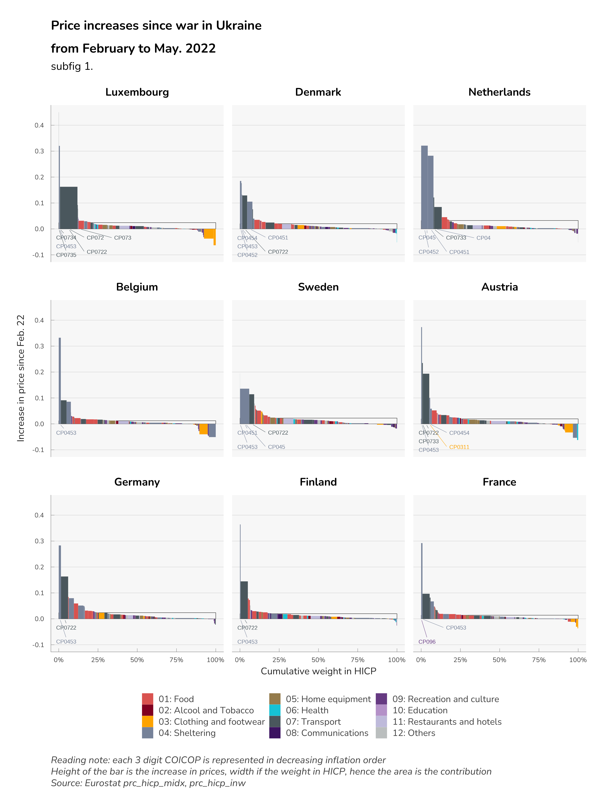
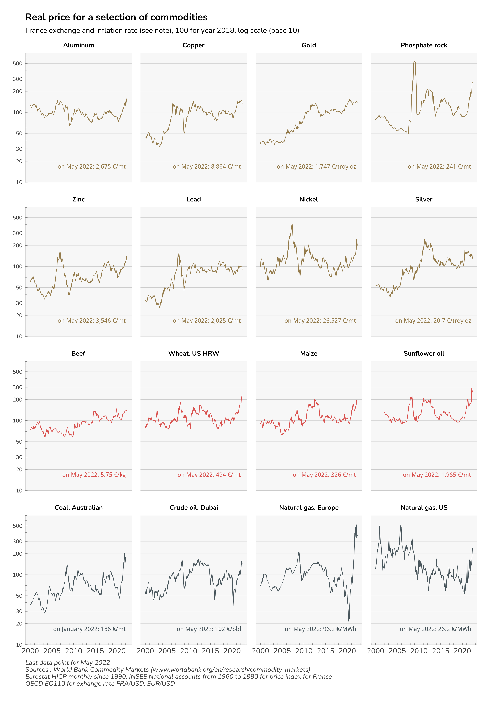

# Social Impact of the War in Ukraine (SIWU)

> [François Geerolf](mailto:francois.geerolf@sciencespo.fr), [Xavier Timbeau](mailto:xavier.timbeau@sciencespo.fr), [Guillaume Allègre](mailto:guillaume.allegre@sciencespo.fr)

### last update

HICP update october 19, 2022 [Social Impact of the War in Ukraine](https://ofce.github.io/SIWU/report/SIWU_brief.html)

[as a pdf](report/SIWU_brief_october_22.pdf)

### older versions

-   HICP update July 22, 2022 [Social Impact of the War in Ukraine](report/SIWU_brief_july_22.pdf)

-   HICP update June 17, 2022 [Social Impact of the War in Ukraine](report/SIWU_brief_june_22.pdf)

-   HICP update May 18, 2022 [Social Impact of the War in Ukraine](report/SIWU_brief_may_22.pdf)

## Aim

This repo contains code, data and documents to replicate some work done for the S&D group at the European Parliament.
Using data from Eurostat HICP per coicop at the level 92 and data from Eurostat on consumption share (of income) per quintile and coicop (at the level 38) we evaluate what is the impact of recent price increases on income per quintile.

Data on HICP is updated every month (with a flash estimate in between).
Data on quintile consumption share is available for year 2015 (except in Italy, for which data is available in 2005).

## Tranformation of data

The data is then transformed through numerous steps :

1.  We deseasonalize all prices from the HICP every month.
    For performance reasons, we use a loess algorithm (`stats::stl`) instead of the usual X11/X13.
    The deseasonalization is especially important for CP03 (clothing) products.

2.  We extrapolate consumption share per quintile from the level 38 (coicop 2) to to 92 (coicop 3) using a proportional rule.

3.  We shift consumption share per quintile at the level 3 (extrapolated from level 2) from 2015 to 2021 using HICP weights.
    In the process, we keep only relative shares and align on HICP weights.
    This allow to break down aggregate effect by quintile.
    We have not dealt with chained indexes issues in the process.
    The effect we calculate per quintile per product is not summing to the aggregate effect.
    However, we checked the discrepancy which remains in tolerable margin.

We got this kind of results:

And a break down per quintile:

summarized in thins comparison graph:

## Other data

Using World Bank commodity prices we build a real price index starting in 1960 for a selection of commodity and build a graph panel of those real indexes.
The scale is a log base 10, in order to provide meaningful analysis and all indexes are rebased as being on average 100 during the year 2018 (before the COVID, roughly).
This produce the following graph:

## Report

A report is presenting data and analysis.
It is located in the `report` folder.
The source for report is in `SIWU_brief.qmd` and relies on `{quarto}`.
A pdf can be rendered ([SIWU_brief.pdf](report/SIWU_brief.pdf)) or an HTML accessible there: [SIWU_brief.html](report/SIWU_brief.html)

## Structure of files and folders

R sources files are in the `R` folder.

`make ISGU data.r` download data from eurostat using some convenience function around the `{eurostat}` package.
Install `{ofce}` from github (`devtools::install_github("ofce/ofce")`) and proceed to transformation of data.
data is cached in `data` but is not on the github repo, so you need to run sources files to download everything.
Results are on the repo.

A check is done each time you run `make ISGU data.r`, to assess if there is an update of Eurostat data and download the latest version of data.
No history or versionning of datasets from Eurostat is kept.

`graphiques.r` is producing the graphs which are saved (mostly as `png` and `svg`) in the folder `svg` plus the annex tables.
It produces the `sorties.Rdata` necessary to run the `SIWU_brief.qmd`.

`nrg_bal.r` produces the table 1 of the report using data from Eurostat on energy balances.

`commodity prices.r` produces the real price graph above and downloads data from World Bank.

Once all dependencies are installed, data should be updated automatically when available.
Install notably `devtools::install_github("ofce/ofce")`, `{eurostat}` and some more!

`choc de prix.r` is an attempt to use daily data from Yahoo Finance, but some symbols are not always available so we dropped this method.

Sources are moderately commented and comments are usually in french.

## License

All code, texts and graph are under a [CECILL-B license](LICENSE.TXT) (a french licence in the spirit of MIT licence).
Data is from (what we believe is) open data from various providers and may be subject to specific licenses.
