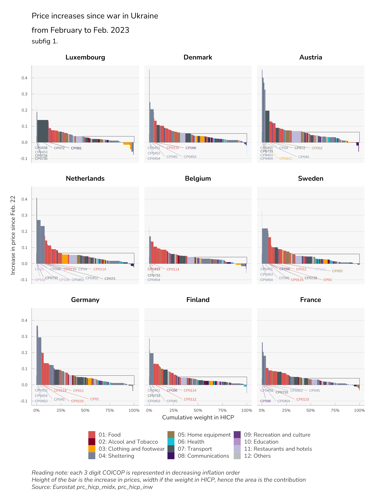
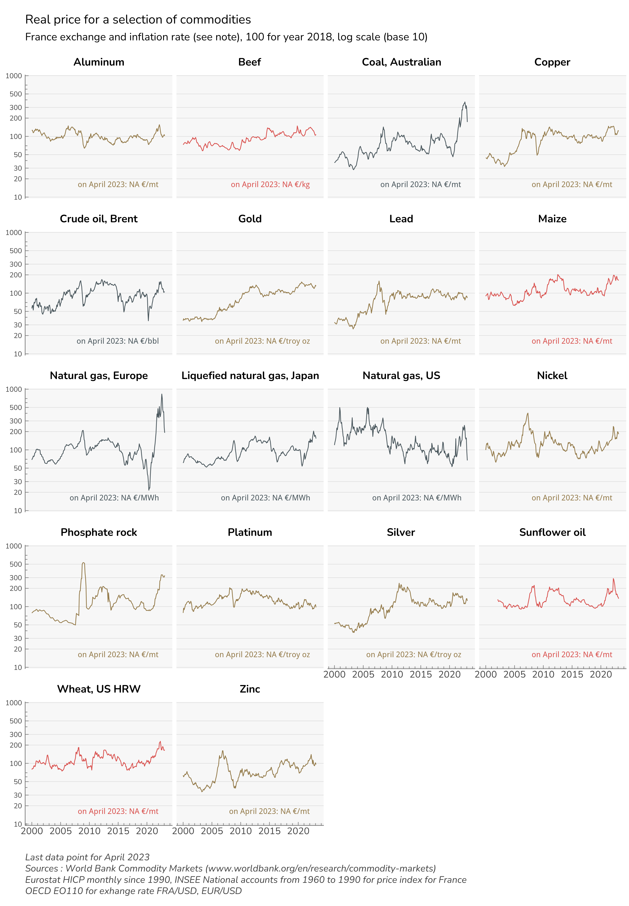

# Social Impact of the War in Ukraine

## aim

This repo contains code, data and docs to reproduce a work done for the S&D group at the European Parliament. Using data from Eurostat HICP per coicop at the level 92 and data from Eurostat on consumption share (of income) per quintile and coicop (at the level 38) we evaluate what is the impact of recent price increases on income per quintile.

Data on HICP is updated every month (plus a flash estimate in between). Data on quintile consumtion share is avalaible for the year 2015 (except Italy, 2005).

## tranformation of data

A number of transformation are applied to data :

1.  we deseasonalize all prices from the HICP every month. For perfomance reasons, we use a loess algorithm (`stat::stl)` instead of the usual X11/X13. The deseasonalization is important for CP03 (clothing) products.

2.  we extrapolate consumption share per quintile from the level 38 (coicop 2) to to 92 (coicop 3) using a proportional rule

3.  we shift consumption share per quintile at the level 3 (extrapolated from level 2) from 2015 to 2021 using HICP weights. In the process, we keep only relative shares and align on HICP weights. This allow to break down aggregate effect to quintiles. We have not dealt with chained indexes issues in the process. The effect we calculate per quintile per product is not summing to the aggregate effect. However, we checked the discrepency which remains in tolerable margin.

We got this kind of results:

And a break down per quintile:

## other data

Using World Bank commodity prices we build a real price index starting in 1960 for a selection of commodity and build a graph panel of those real indexes. The scale is a log base 10, in order to provide meaningful analysis and all indexes are rebased as being on average 100 during the year 2018 (before the COVID, roughly). This produce the following graph:

## report

A report is presenting data and analysis. It is located in the `doc` folder. The source for report is in `SIWU_brief.qmd` and relies on `{quarto}`. A pdf can be rendered ([doc/SIWU_brief.pdf](doc/SIWU_brief.pdf)) or an HTML accessible there: [doc/SIWU_brief.html](doc/SIWU_brief.html)

## structure of files and folder

`make ISGU data.r` download data from eurostat using some convinience function around the `{eurostat}` package. Install `{ofce}` from github (`devtools::install_github("ofce/ofce")`) and proceed to transformation of data. data is cached in `data`. A check is done each time you run `make ISGU data.r` that there is an update of eurostat data and download the latest version of data. No history is kept.

`graphiques.r` is producing the graphs which are saved (mostly as `png` and `svg`) in the folder `svg` plus the annex tables.

`nrg_bal.r` produces the table 1 of the report using data from Eurostat on energy balances.

`commodity prices.r` produces the real price graph above and downloads data from World Bank.

Once all dependencies are installed, data should be updated automatically when avalaible.

`choc de prix.r` is an attempt to use daily data from Yahoo Finance, but some symbols are not always available so we dropped this method.

Sources are moderately commented and comments are usually in french.
