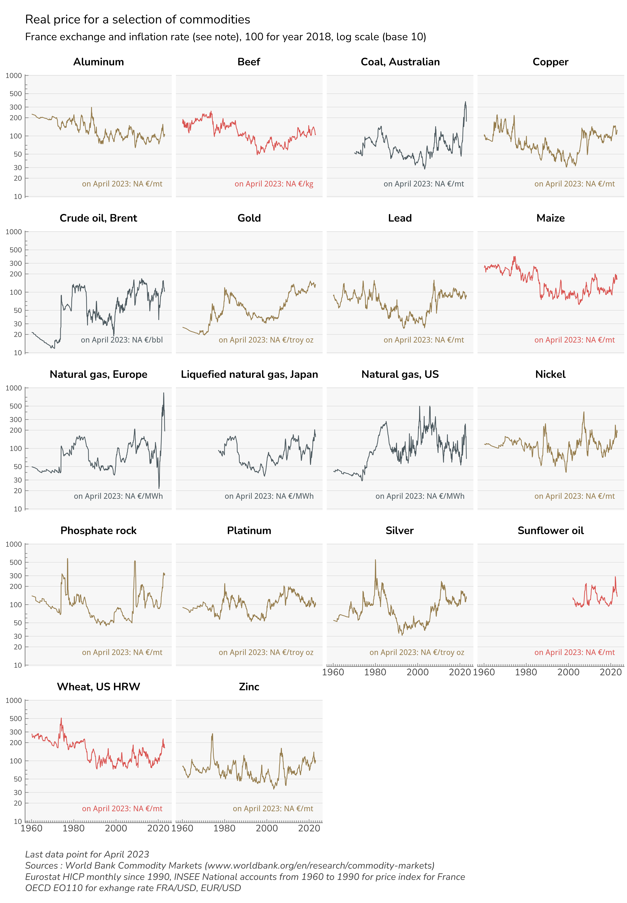
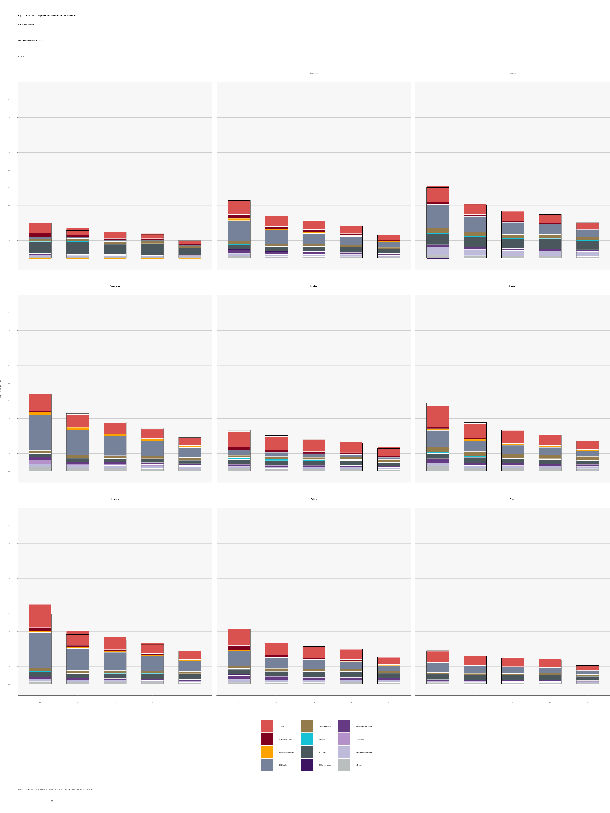
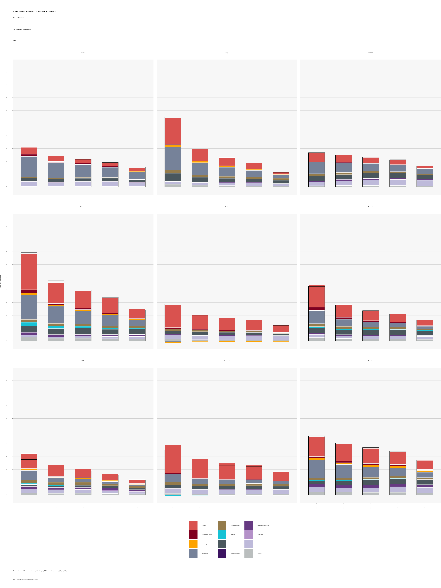
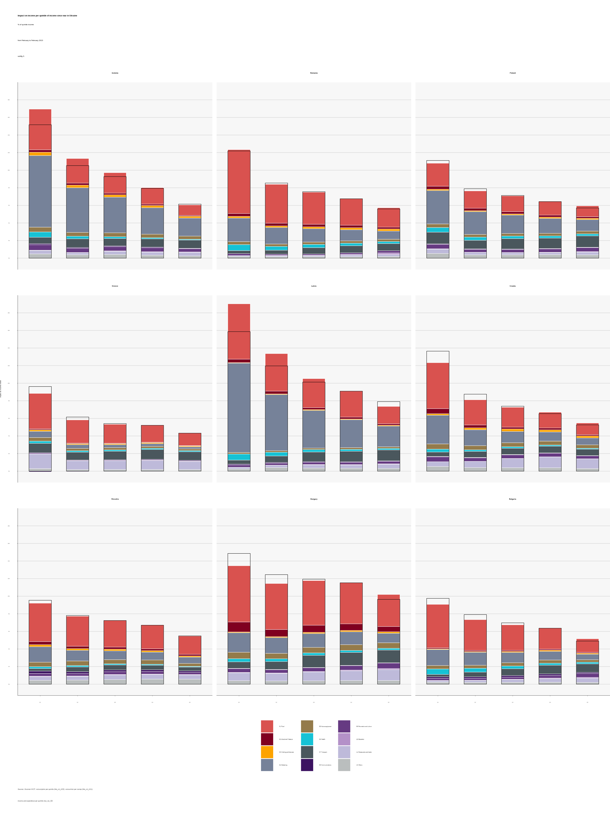
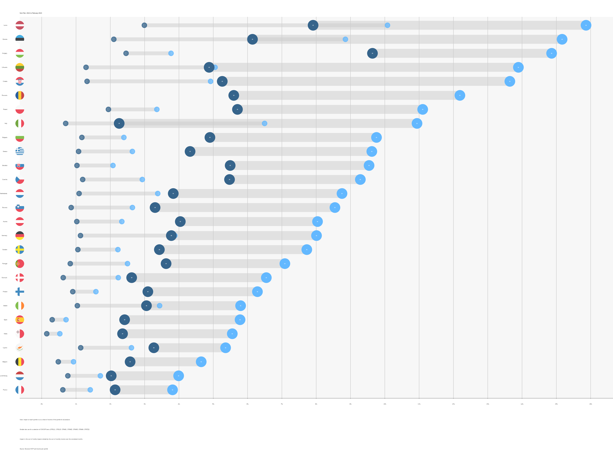
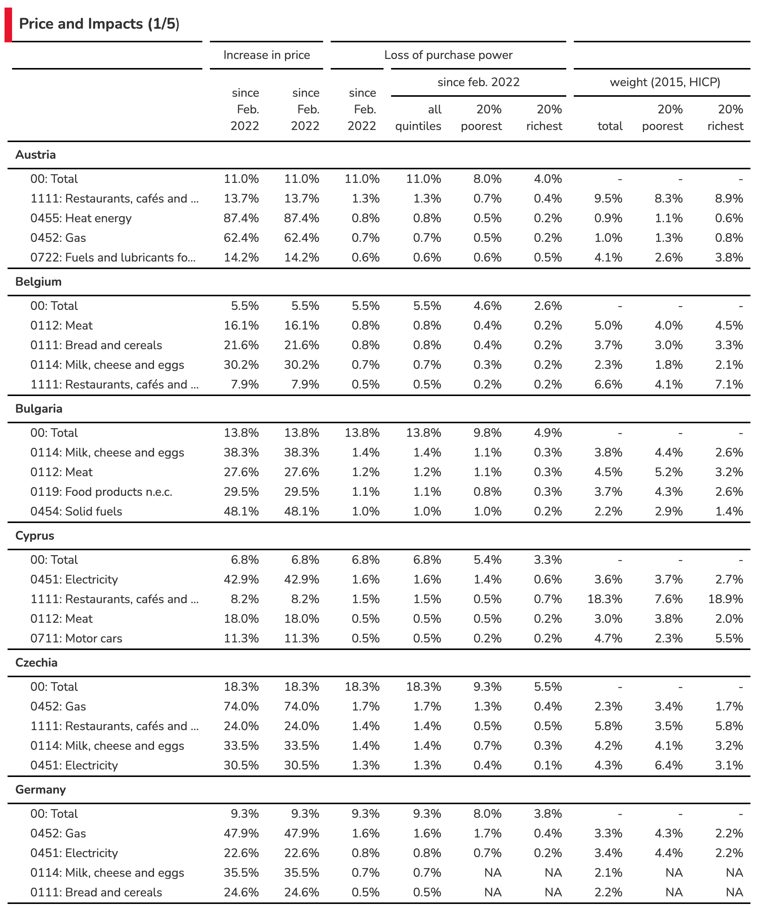
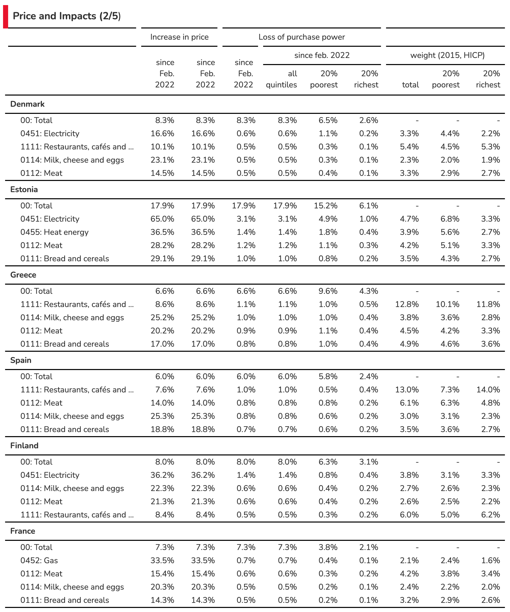
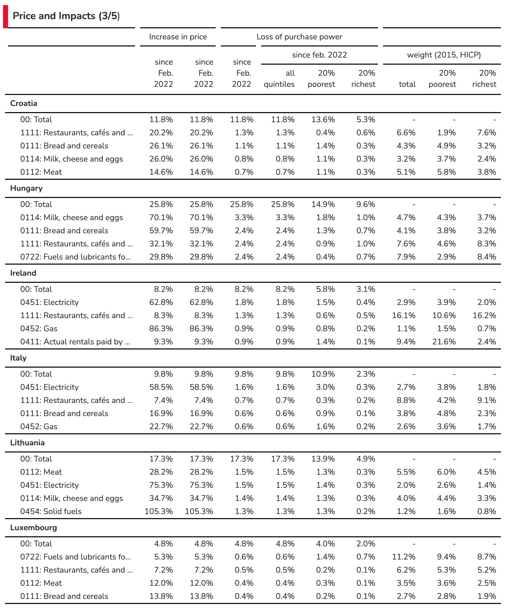
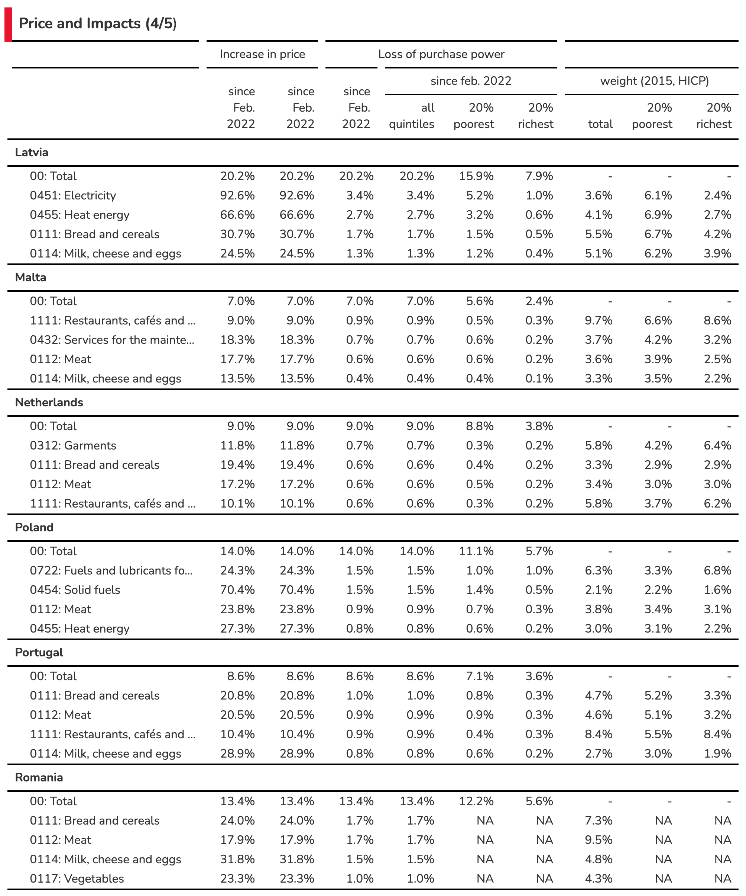
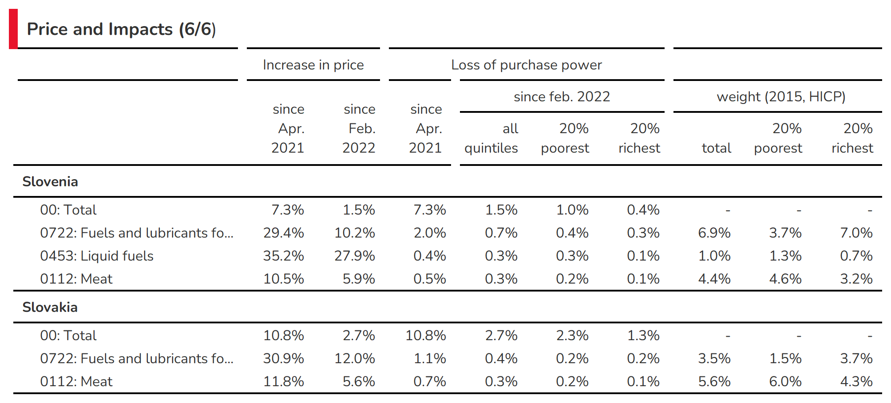

```{r setup, include=FALSE}
knitr::opts_chunk$set(echo = TRUE)
```

# Social Impact of War in Ukraine brief

The invasion of Ukraine by Russia on February 24, 2022 opens a new world that calls for great cohesion in Europe. The
response operates in multiple dimensions, and we propose to analyse the direct consequences of the invasion on the daily
lives of Europeans in the short term.

The main channel that we identify, concerning the social impact of the War, is the rise in the prices of consumer goods
or services linked to actual or anticipated interruptions in the delivery of certain products imported from Russia or
Ukraine. These products are mainly crude oil, gas, certain cereals or oil seeds, nitrogen fertilizers and other products
used in industry. There are generally substitutes (of origin or nature) for these products, but the rigidity of supply
chains and/or production capacities have led to a rise in prices since (and before) the war started. The partial
exclusion of Russia from the Western financial system and the prospect of an embargo extending to gas supplies amplifies
the price movement. Evidently, an embargo would amplify it further, with large impacts on prices, and probably also
volumes (via quotas).

These price hikes are cascaded down to end consumers in the European Union. The price of gasoline at the pump reacts
quickly to changes in the price of oil. For other goods, the contracts (between the final consumer and his distributor,
between the distributor and the supplier) are complex and can introduce inertia or an absence of transmission. Other
prices can increase in cascade such as electricity through indexation or price formation as for the single market for
gas or electricity. However, subsidies or price regulations can prevent the price hikes cascades.

## Methodology

Our methodology is as follows:

1.  We identify the prices that have experienced a significant increase between several dates, mainly between February
    and April, 2022, which can be attributed to the invasion of Ukraine. We use Eurostat's HICP at the finest level of
    disaggregation according to the COICOP nomenclature to distinguish price increases in (notably) energy, food,
    housing and transport (next update 17 June 2022),
2.  We use Eurostat's Household Budget Surveys (HBS 2015) to identify the structure of consumption by income quintile
    (using hbs_str_t223 database).
3.  We then estimate the impact of price hikes in euros and in % of income by income quintile for each of the member
    states of the Union and per product identified using HICP from Eurostat, from which seasonal patterns are
    removed[^1] (allowing monthly analysis).
4.  We offer an analysis and visualization of the information. Updated and complementary data are accessible at
    <https://ofce.shinyapps.io/siwu/>. 
    
## Introduction

The most important tensions concerning price hikes in Europe today come from the gas market. Gas is one the main source of energy in Europe (21.5% of EU's primary energy consumption ; 32.1% for households) and Russia is the main supplier. Furthermore, Gas is relatively cheap: the average final
    household price for kWh is 6.5 cents against 21,6 cents per kWh from electricity. The EU imports 80% of its total
    gas needs, around half of it (43%) from Russia. Other suppliers include Norway (24%), Algeria (13%) and the US (7%).
    On March 8th, the Commission published a plan (*REPowerEU* to reach compete independence from Russian fossil fuel
    "well before the end of the decade". However, in the short term, supplier substitution is hard as most of these
    imports come through pipelines and infrastructures for Liquefied natural gas (LNG) is insufficient. As for now,
    Russia has continued to supply European countries (more or less, the recent weeks have seen some developments there)
    under the terms of long-term contracts signed with national energy companies. It has however decreased its supplies
    in the spot market. Also, the fear of an embargo has had a huge impact on gas prices in Europe. Dutch TTF Gas
    Futures trade since April 2022 at around 100 euros per megawatt hour, against 20 euros at the same time in 2021.
    This affects directly wholesale electricity prices as gas is a major contributor to EU electricity production.
    Consumers across the European Union have different exposures to energy price increases, depending on nationality,
    income, mode of transport and domestic heating. Households represent a quarter (26%) of final energy consumption.
    National exposures of households to energy prices differ greatly. If we look at energy consumption in housing by
    households, at the EU level, space heating represents according to Eurostat (2019) 63% of consumption; and 32% of
    energy consumption is provided by gas. However, gas is not used in small islands like Cyprus and Malta (0%); and
    marginal in Sweden (0,3%) and Finland (0,5%), who use mostly derived heat and electricity (see Table). On the other
    hand, gas represents the majority of energy in housing in the Netherlands (69,3%) and Italy (51,8%). Although, the
    need of energy might differ between nations, especially for heating purposes due to climate and thermal efficiency
    of housings: households in Malta, Portugal, Spain and Cyprus use far less energy than in Luxembourg, Austria and
    Denmark. Likewise, passenger mobility differs between Italy, Norway, Finland, Germany, France (above 13 000 km per
    capita per year) on one hand, and Romania and Slovakia (around 7500)[^2]. Moreover, only 30% of travel distance in
    Romania is by car as driver against 63% in Italy. Some, but not all, of these differences can be attributed to
    income differences.

[^1]: We use a loess smoothing algorithm giving results close to X11/X13 procedures from Bureau of Census. All codes are
    available at github.com/ofce/siwu.

[^2]: Odyssee-Mure :
    <https://www.odyssee-mure.eu/publications/efficiency-by-sector/transport/passenger-mobility-per-capita.html>

{.graph width="16cm"}

Countries, gas and electricity companies and consumers are affected differently in the European Union through volumes,
but also through prices. Despite price convergence due to the evolution towards liberalisation and a single European
energy market, national utilities and consumers face different prices depending on the contracts signed with suppliers.
Most European countries have gone from oil-indexation to gas-indexation in the long-term contracts signed with gas
suppliers. In the European Union, oil-indexation represented nearly 80% of contracts in 2005, and only around 20% in
2019, replaced by gas-indexation. This trend started, and is most pregnant in Northwest Europe (Belgium, Denmark,
France, Germany, Ireland, Luxembourg, Netherlands). The change is less dramatic in Mediterranean (Greece, Italy,
Portugal, Spain). Gas-indexed contracts have not really increased in Southeast Europe (Bulgaria, Croatia, Romania) or
Scandinavia and Baltics (Finland, Sweden, Lithuania, Latvia, Estonia). This is important because, in this crisis, oil
has not increased as much as gas (Brent is up 52% in 1-year, 35% year-to-date). Also, consumers might be more or less
protected by the contracts they signed with the gas and electricity utilities. There is a trend towards more
variable-price contracts, especially in countries like Luxembourg, Slovenia, Ireland, Spain, Belgium, Czech Republic and
the Netherlands: in these countries, more than 50% of consumers have variable-pricing gas contracts. In Belgium,
suppliers have the right to index their variable gas and electricity prices monthly and use the indexing parameters of
their choice (of course, their interest is to link it directly to their wholesale price so that they do not take any
market risk). The government justified the decision in the objective to "bring the bill closer to the market reality".
However, if demand is relatively inelastic in the short-term, this price-liberalisation increases volatility and risk
for countries that produce gas as well as, and more importantly in this case, final consumers.\
Consequently, the impact on consumers, as analysed in this study, does not presume of the impact on the economy as a
whole: the cost of the price increase can also be borne by the state (through subsidies), or by state or private
utilities tied by regulations (in France, EDF bore part of the total cost of electricity price increases). Impact on
households might differ according to the preferred policy response: freeze in prices compensated by corporate subsidies
or direct transfers to vulnerable households according to income and/or energy consumption. In both cases, computability
will be different: in the first case, for the same amount of additional government deficit, there will be no or less
change in prices and income, whereas in the second case both prices and household income will soar.

We can distinguish several kind of policies that have a different impact on what we measure in this report :

-   What most economists would suggest in normal times is to not touch the 'price-signal' and compensate the poorest
    households with energy cheques. This would not impact the inflation as measured in this report but the decrease in
    living standard is partially compensated, borne by the state, depending on generosity of the cheque.

-   One can also stress that the impact on welfare of energy price increases depends both on income and energy needs.
    Governments can therefore compensate consumers via cheques that also depend both on income and energy consumption in
    the last months. This does not decrease the price of energy (which would increase demand) but compensate according
    to volumes consumed. With such a strategy, inflation could remain high, but compensated by the State according to
    historical consumption : there would probably less winners and losers (i.e. variations in living standard) than with
    a compensation based solely on income.

-   Alternatively, governments can act to deflate prices via (temporary) tax cuts or direct subsidies, and/or price
    caps, for all or for the most vulnerable in income and/or energy needs. Price subsidies for all is the most
    expensive instrument for the state budget, and it increases demand (relatively to other policies) for energy. It is
    not usually recommended by economists who think in terms of cost/benefits analysis. However, if everyone is
    preserved from price increases in the short term, it prevents the crisis from becoming a political issue : the true
    cost and transfers are hidden, or a least their discussion is temporarily transferred to, it is hoped, after the
    crisis (when the true aggregate cost is supposedly known and political discussion does not depend on anticipations).

This later element has some consequences for monetary policy. By cut price increase before they reach consumer price,
ones prevent indexation mechanism (pension, minimum wage, social compensation) and thus prevents partly so called second
turn effects. This then simplify the conduct of the monetary policy as response to external price shocks can't be
countered by a restrictive monetary policy. Thus by preventing partially pass through to the economy, at a high fiscal
cost, monetary policy can be free of inflation risk and address the slowdown of the economy induced by the transfer to
commodities producers.

{.table width="16cm"}

# Results : general discussion

The 3 following graphs are displaying the most important increases in prices since the begining of the war in Ukraine.
In most countries, the COICOP categories concerned by prices increases are transportation especially CP0722 which are
"Fuels and lubricants for personal transport equipment", and various categories of energy for housing (heating, hot
water or appliances), in the categories CP0451 to CP0454 (Electricity, Gas, liquid fuel, solid fuel). In some countries,
some food categories are displaying a sharp increase (especially oils and fat). Tables in the annex are summarizing the
most important increases.

{.graph width="16cm"}

{.graph width="16cm"}

{.graph width="16cm"}

The following 3 graphs are displaying the breakdown by quintile of the impact in purchasing power per countries.

{.graph width="16cm"}

{.graph width="16cm"}

{.graph width="16cm"}

Compared to other countries, and due to governmental policies, households in France are relatively preserved by price
increases. This is also the case in Sweden, Cyprus and Malta, three countries that are not dependent on gas for
household heating. In Sweden, use of gas or oil for heating is marginal since 2010 for domestic heating. Oil, which
represented 50% of energy consumption in the early 1980s has been replaced by heat networks (that themselves rely only
marginally on fossil fuel)[^3] and electricity, also decarbonized. National differences in how household are impacted
today are therefore partly the consequence of long-term policies (environmental and/or geopolitical).\
On the contrary, households in the Netherlands and Belgium, who rely mostly on gas for heating, are most affected. In
Slovenia, price hikes in housing are more than compensated by governmental measures (notably, an exemption that
decreased electricity prices by 35% on average from February to April). It is also noticeable that households in the
first income quintile tend to be more affected (before eventual governmental transfers), in percentage of income. This
is not surprising: poorer households tend to consume more energy and food as a share of income. Poorer households, from
the first quintile, are most hit in Greece, Netherlands, Lithuania. This is due mostly to housing expenses in the
Netherlands, but food also plays a role in Greece and Lithuania. The next Figure confirms this conclusion. We can
clearly see that for all countries (except Slovenia), the impact on households from the first quintile (Q1) is greater
than for the richest households (Q5). This is particularly true in Lithuania, the Netherlands and Greece. The difference
between Q5 and Q1 is also greater in countries where households are most affected: the poorest households bear the most
risk from energy and food price volatility.

[^3]: According to Swedish Environmental Agency, total greenhouse gas emission from buildings (heating) decreased from
    9.30 million tonnes of carbon dioxide equivalents in 1990 to 0.9 in 2018
    <https://ec.europa.eu/energy/sites/ener/files/documents/se_2020_ltrs_official_translation.pdf>

{.graph width="16cm"}

# Results: discussion by country

## Austria

In terms of overall impact of price hikes on living standard, Austria stands in the mid-tier amongst EU countries (15th
at 1,3%). The main price increases borne by Austrian consumers concern liquid fuels and fuels. Policies include 900
million euros for energy tax cuts over 12 months, energy cheques for all and for the poorest (300 euros), and commuting
subsidies.

## Belgium

Belgians are among the hardest hit in the European Union if we look at price increases since September 2021 (6,1%).
Since February 2022, prices have increased a lot less. This is mostly due to Gas and Fuels: prices have increased early
in Belgium, maybe due to the fact that a lot of consumers have variable-price contracts. At first, policy was targeted
to the poorest (500, 000 households) through social energy tariffs and an energy check. In February, a VAT reduction for
electricity from 21% to 6% was announced from March to July (extended to September, as well as a check for every
household. In March, a 200 euros cheque was announced for oil-heated households and taxes on diesel and petrol were
reduced. It is worthy to note that, as the crisis extended policies went from targeted checks to decreased prices for
all, which can explain why we see in our data price increases mostly in the end of 2021. Despite social energy tariffs,
since February, poorer households (Q1) have seen a larger decrease in living standards due to price hikes (0,7%) than
richer households (0,4%) although the absolute difference is not that large.

## Bulgaria

Bulgaria is one of the hardest hit countries in the European Union by price increases since September (6,7%) and
February (1.9%). This is due to large price increases in fuels and oils. Food items (Cereal, Meat, Milk) have also gone
up in prices, probably due to greater dependency to Ukraine. Also, being a poorer country than average in the EU, the
weight of Food and beverages, Utilities and housing and Transportation is also higher ; the three broad categories
represent almost half of the CPI basket. Within Bulgaria, the poorest households are hardest hit since February (2,3%)
than the richest (1,1%). At first (October) policy response was directed to companies in order to cap electricity prices
for businesses. In December, a new ruling coalition voted to freeze power and heating prices.

## Cyprus

Cyprus is in the low-tier for countries impacted by price increases. Its status as a an island insulates the country
from a direct impact of natural gas inflation: as with Malta, the country does not supply households with gas. Price of
electricity has gone up, even more than in other EU countries : reduction in VAT (from 19 to 9) only went into effect in
May. Although, the country imports electricity from Turkey (for northern Cyprus households) and these prices have gone
up even more than in the EU.

## Czechia

Czechia is in the mid-tier for countries impacted by price increases since February but in the top-tier since September.
Electricity has gone up 17% since September. This is due to policy responses in December when the government
(temporarily) exempted electricity and gas from VAT (from 21%) for households and energy-intensive industries. This
exemption could be made permanent for renewable energies. In another concern, the government also want a permanent
reduced VAT on energy (at 10%): this crisis might impact the long-term level of taxation of energy across a number of
European countries.

## Denmark

Denmark is one of the least impacted countries since January (and September). If the price of gas has gone up, it
represents a lower share of the CPI basket than in other countries. The same is true, to a less extent, of electricity,
which has gone up mostly in 2021. The main policy is a heat-cheque for the most vulnerable households, mostly for
households with gas-heaters (on a per-household basis, thus leaving incentives unchanged).

## Estonia

Estonia's consumers are the second hardest hit by price increases (representing 3,3% of income since September, 1,3%
since February). Fuels and Heat energy prices have gone up more than 20% since September, and Electricity 17%) and the
weight of these items are high in this northern European country (Talinn is at the same latitude than Stockholm and just
80km from Helsinski). The country put in place social electricity tariffs since September and reduced electricity prices
for all since October. In January the government put in place a cap on electricity and gas prices for households.

## Finland

Despite being a close neighbor from Estonia, Finland is in the lower-tier in terms of price impact. Energy consumption
is high but relies less on fossil fuels. As of 2008, the country has four nuclear reactors in two power plants,
producing 60% of its electricity needs. Natural gas js not used for individual heating. Domestic heating relies
primarily on electricity and district heating (which rely mostly on oil, peat and wood). In tems of policy, the
government increased the maximum deduction for commuting expenses (density is low and mileages are high). The annual
ceiling for increases to tariffs has been reduced from 15% to 8%.

## France

France is one of the lowest hit nations in Europe by price increases (and the lowest since September). For consumers,
price increases for Electricity (5%) were far lower than neighbouring Spain (52%), Italy (55%) or Belgium (32%), mostly
due to government imposed price regulations. To cover the loss, EDF increased its capital by 3 billion euros in March
(for a total estimated cost of 8 billion). Also, Cheques have been emitted for the lower income half of the population.
And in March, a 15 cents discount on petrol prices at the pump was decided by the government. It's probably not a
coincidence that broad / not targeted measures were taken during this electoral year.

## Germany

German consumers are in the mid-tier concerning the impact of price hikes on real income (1,8% since February). Gas
prices have not gone up as much as in the Netherlands and Belgium. Electricity price increases (13% since September) has
been moderate compared to other countries. As in France, the government intervened on the price of electricity, reducing
the EEG surcharge at a cost of more than 3 billion. In Mach, further measures were announced, including reduction in
fuel prices though a tax cut (30 cents for gasoline) and a 300 euros cheque. Overall costs of policies shielding
consumers from the rise in energy prices amount to around 30 billion euros.

## Greece

Greece is also in the mid-tier in terms of impact on consumer prices. Notably, the price of electricity exploded since
September 2021 (64%). However, the government decided on a 60% rebate capped at 600 euros and for households earning up
to 45 000 euros a year. This will be financed partly on a tax on the profits of energy suppliers. This might have, in
part, some of the same effects of a regulated price but will not appear similarly in the national accounts, inflation,
and household income.

## Hungary

Hungary is only moderately hit by price increases, despite having a land border with Ukraine. Energy prices for
households are regulated (below cost) and did not move. Furthermore, a price cap was introduced on retail fuel prices.
Price hikes are felt mostly through food prices (bread, milk, restaurants) and cars. Ireland Ireland is also relatively
protected from energy price inflation., as reflected by the presence of Restaurants and Motor cars in the main
contributors. The price of liquid fuels exploded but only represent 1% of consumption. The main policy is a 30% tax
rebate on heat, electricity and broadband.The country also made mean-tested payments to households with the highest cost
of home heating, and a 200 euros electricity credit to all households

## Italy

With France, Italy is one of the countries who suffered the least from inflation since September. It is in the mid to
lower tier since February. It entered the crisis with low growth and low inflation. The government implemented tax cuts
in the gas and electricity sector, and also a 30 cents reduction of gasoline through July. Data for consumption share is
not available for the year 2015. We used data for the year 2005. Latvia Latvia has seen an important impact of price
increases (6,8% of income since September, 2,2% since February). Since February, half is due to personal transport,
which went up 14% (28% since September) and represent 7% of the consumer basket. Policies consist mainly in reducing the
price of electricity.

## Lithuania

Not surprisingly, Lithuania is in a similar situation as Latvia. Transportation cost went up by the same amounts and
have the same weight in consumption. During the crisis, the government decided to postpone the liberalisation of the
energy market. It is noteworthy that impact on income since February is much higher for poorer households (2,6%) than
richer (0,8%).

## Luxembourg

Luxembourg consumers were averagely hit by price increases. Since September, natural gas prices exploded (+58%) but
weight in consummation basket is moderates (2%). As elsewhere, poorer households (1.6% of income) are more impacted than
richer (0,8%).

## Malta

Malta is one of the least impacted countries in the European Union. As for Cyprus, it does not use natural gas for
domestic heating. The energy provided is regulated and prices frozen. Price increases for consumers concern mainly food
items.

## Netherlands

The Netherlands is perhaps both the most deregulated country in the European Union and the hardest hit by energy price
inflation (3,4% since February, 8,3% since September). The main price hikes come from electricity (+112% since
September) and Gas (+98%). Many consumers have variable price contracts and spot and future prices exploded. Also, the
government is less prone to alter the price mechanism than in other countries. Tax cuts are only in effect since April
2022 (when other governments intervened in September and other did not need to intervene due to frozen prices).

## Poland

Poland shares the largest frontier with Ukraine in the European Union and hosts the most refugees. It is also in the top
tier in terms of impact of prices on income (+2,2% since February, 6,2% since September). Gas prices, fuels, petrol
increased severely. Since January, VAT is reduced on food, gas, petrol and heating. A cheque provides a maximum of 100
euros per person depending on income and type of heating.

## Portugal

Portugal is in the low-tier in terms of impact on consumers, which comes half from food, half from transportation
(petrol). Energy tariffs for household consumers are regulated and are anticipated to decrease in 2022 relative to 2021.
An Autovaucher reimburses up to 5 euros (20 since April) per month from petrol purchases (bank account reimbursement for
those using the special Autovoucher card). This will probably be accounted for as a household transfer (see box).

## Romania

Romania is a southern neighbour to Ukraine and consumers suffer an average impact on prices, mostly from Gas, Petrol and
Food : main contributors are not concentrated. Bread prices went up by 10% since September, which hurts the poorest
households. Prices decreased real income of the poorest households by 2,6% since February against 1,1% for the richest.
The government announced compensations for Electricity and gas. Government will compensate 4 lei per kw for households
who respect a consumption limit.

## Slovakia

Slovakia is a mid-tier country in terms of impact on prices, with moderate contributions across the board : Gas, Petrol,
Heat, Electricity but also Bread and cereals. Price hikes hurt poorest households (1,5%) more than the richest (0,9%).
Policy is mostly targeted to electricity prices, through a deal with the national company.

## Slovenia

Slovenia is one of the lowest hit country in the European union, including price decreases since February. There are,
however, a lot of monthly variability. Gasoline prices were caped in March and from February to end of April households
were exempt from paying electricity bills and excise duties on electricity (Bruegel).

## Spain

Spain is in the top tier for price impact on consumer income (2,2% of income since February, 6,3% since September). The
main contributor is Electricity followed by Transportation (Petrol). The poorest households are hit almost three times
as much as the richest (3,2% vs 1,3%). VAT was decreased on electricity according to consumption. A heating social bonus
was also passed. In March Spain obtained permission from EU to get the status of energy island, which will enable to
reduce the role of gas in the price mechanism in the electricity market, and introduce regulated rates.

## Sweden

Since February, price increases have a moderate impact on income in Sweden, mostly through Electricity and Petrol.
Sweden does not use natural gas in housing heating anymore (replaced with district heating and electricity). Tax on
diesel and petrol were reduced since June. Housing and Child allowances were increased.

# Annex

{.annex width="17cm"}

{.annex width="17cm"}

{.annex width="17cm"}

{.annex width="17cm"}

{.annex width="17cm"}

{.annex width="17cm"}
